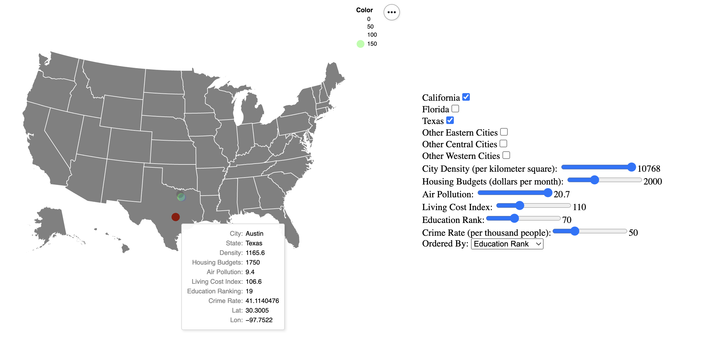

# Finding the Best Place to Live
## Overview:
This visualization is designed to help people find the best place to live based on their individual preferences. Users can interact with sliders, checkbox, dropdown menus, and a map selection tool to filter cities based on a variety of features. Only cities that meet the selected criteria will be shown on the map, with color hue and dots size represents the levels or ranking of the feature that users care the most.
## Design:
Safety, environment, education, affordability, and location are key factors in choosing where to live. The interactive graph includes crime rates for safety, air pollution, sunshine percentage, and city density for environment, education rating for education, and housing budget and living cost index for affordability. Cities are displayed on a US map for easy location identification.
## Interactive Tools:
The following features are adjustable with sliders to provide users a clear range of values for filtering: 
  * City Density $(people/km^2)$ 
  * Housing Budget $(dollars / month)$
  * Air Pollution (using PM2.5 Weighted Annual Average)
  * Living Cost Index ($100$ refers to the national average living cost)
  * Education Rank 
  * Crime Rate $(times / 10^3~people)$

Three US states: **California, Florida**, and **Texas**, own the highest number of candidate cities, and these states are also the most popular states for people to tour, work and live in. Hence we provide the check-boxes for the cities in these three states. People who would like to settle in California, may check the box "California" and uncheck the rest to filter out candidate cities in CA. Besides these three states, people also have other filtering conditions like "Other Eastern Cities"(cities in **Alabama, Arkansas, Connecticut, District of Columbia, Georgia, Kentucky, Louisiana, Maryland, Massachusetts, Mississippi, New Hampshire, New Jersey, New York, North Carolina, North carolina, Pennsylvania, Rhode Island, South Carolina, Tennessee, Virginia**), "Other Central Cities"(cities in **Colorado, Illinois, Indiana, Iowa, Kansas, Michigan, Minnesota, Missouri, Nebraska, North Dakota, Ohio, Oklahoma, South Dakota, Wisconsin**) and "Other Western Cities"(**Alaska, Arizona, Hawaii, Idaho, Nevada, New Mexico, Oregon, Montana, Utah, Washington, Wyoming**). 

Cities are displayed on an interactive map, with pop-ups providing full information on each city. Once people find too many cities emerging on the map, they could choose one of the feature, i.e., education or crime rate, from the dropdown menu **Ordered By**, as their primary care by now. The cities on the map would then colored by the values or the ranks of the corresponding feature. Cities with higher values or better ranking in the selected feature with be colored into red or orange, and has larger dot size/opacity; lower values or worse ranking will be colored into blue or purple, and has smaller dot size/opacity. Please see the following example as an instruction of how to find your dream cities. Enjoy this [App](a3.html) !!~

## Example: 
Suppose you want to live in the cities at Carlifornia or Texas, you can first check the boxes "California" and "Texas" to show all candidate cities in these two states. Considering of safe environment and good education system for child, you hope to find the cities with low crime rate (<50), higher education ranking (<70), moderate living cost Index (<110) and housing bugdget (< 2000). After filtering with these conditions, you will find out 4 cities in Texas States satisfy your demands perfectly! Now you think you need to make a comparison on the ranking of the local education system of each cities, then you choose "Education Ranking" in the dropdown of "Order-By" Menu. A large red dots now appear on the map --- it represents **Austin, Texas**, the city with education ranking of $19$ among all US cities, and it's also the city with highest education ranking in Texas! 

## Considered Alternatives:
We considered using interactive charts for each feature, but this would require many charts and may be confusing for users trying to locate each city. Altair is the main visualization tools used for this assignment, but other packages like IPYwidgets and Panel could also provide the similar functions, or even more general modules like window sliders (see **IntRangeSlider** function in "https://cocalc.com/wstein/support/widgets-demos/files/Widget%20List.ipynb"). However, as they're not quite compatible with HTML and webpage build, we finally adopt Altair as still. 

## Development process. 
The most time-consuming step in this project was coding and debugging, as our team members were not familiar with the visualization package and had to learn it before starting. \
Topic Selection (2 hours): Ziyuan Wang, Zhenman Yuan, Kuan-Ting Yeh.\
Data Collection (3 hours for each): Ziyuan Wang, Zhenman Yuan, Kuan-Ting Yeh, Xuchong Du.\
Data Cleaning (5 hours for each): Ziyuan Wang, Zhenman Yuan, Kuan-Ting Yeh, Xuchong Du.\
Readme document (6 hours): Zhenman Yuan, Ziyuan Wang 

Visualization:
1.	Map (5 hours): Kuan-Ting Yeh
2.	Sliders, Checkbox and Dropdown Filterings (20 hours): Zhenman Yuan, Ziyuan Wang
3.	Layout design and color selection (4 hours):  Xuchong Du, Ziyuan Wang

